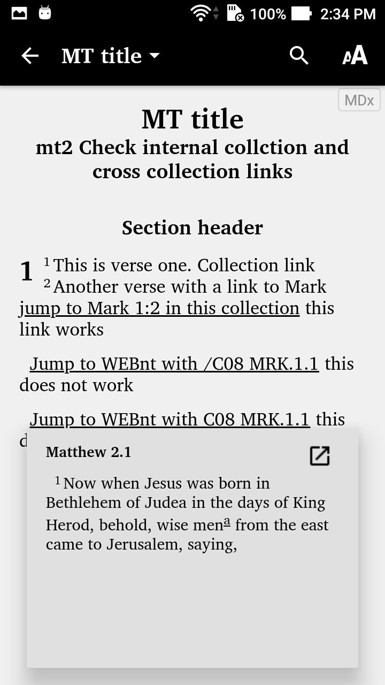
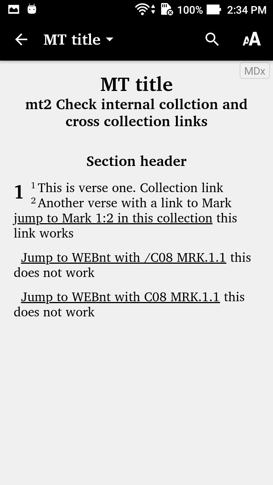
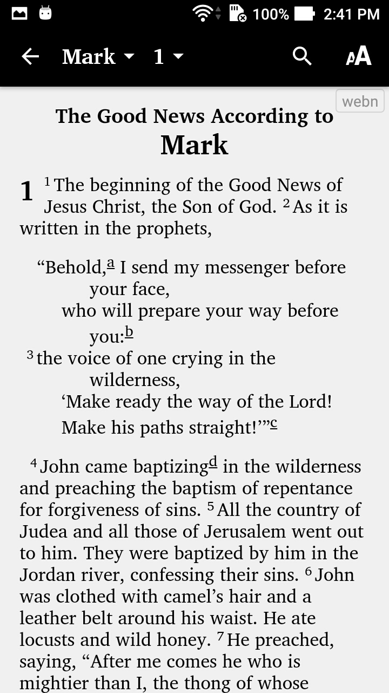

# Markdown internal and cross collection links

## Press link result produces correct reference

```
\id MAT
\h MT marker check
\mt MT title
\mt2 Check internal collction and cross collection links
\c 1
\s1 Section header
\p
\v 1 This is verse one. Collection link    
\v 2 Another verse with a link to Mark [jump to Mark 1:2 in this collection](MRK.1.2) this link works
\p [Jump to WEBnt with /C08 MRK.1.1](/C08/MAT.2.1) produces correct popup but incorrect top right link
\p [Jump to WEBnt with C08 MRK.1.1](C08/MAT.2.1) produces correct popup but incorrect top right link
```



## When pressing the top right corner link, remains on start page.



## The expected result is shown below

